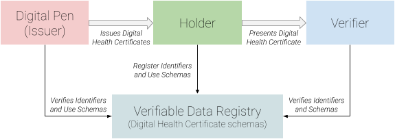
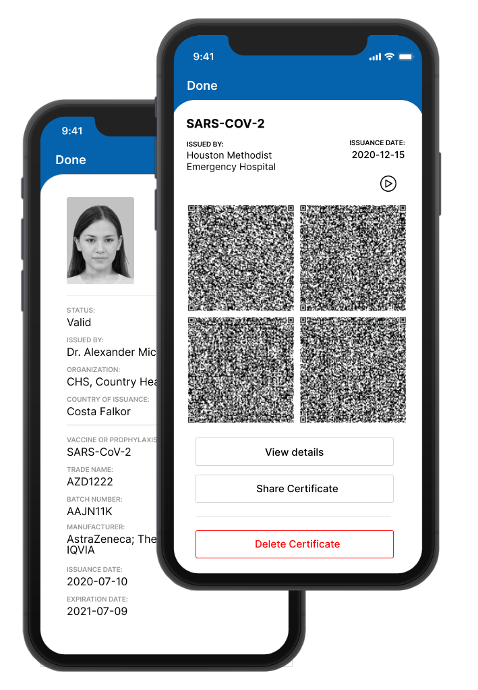
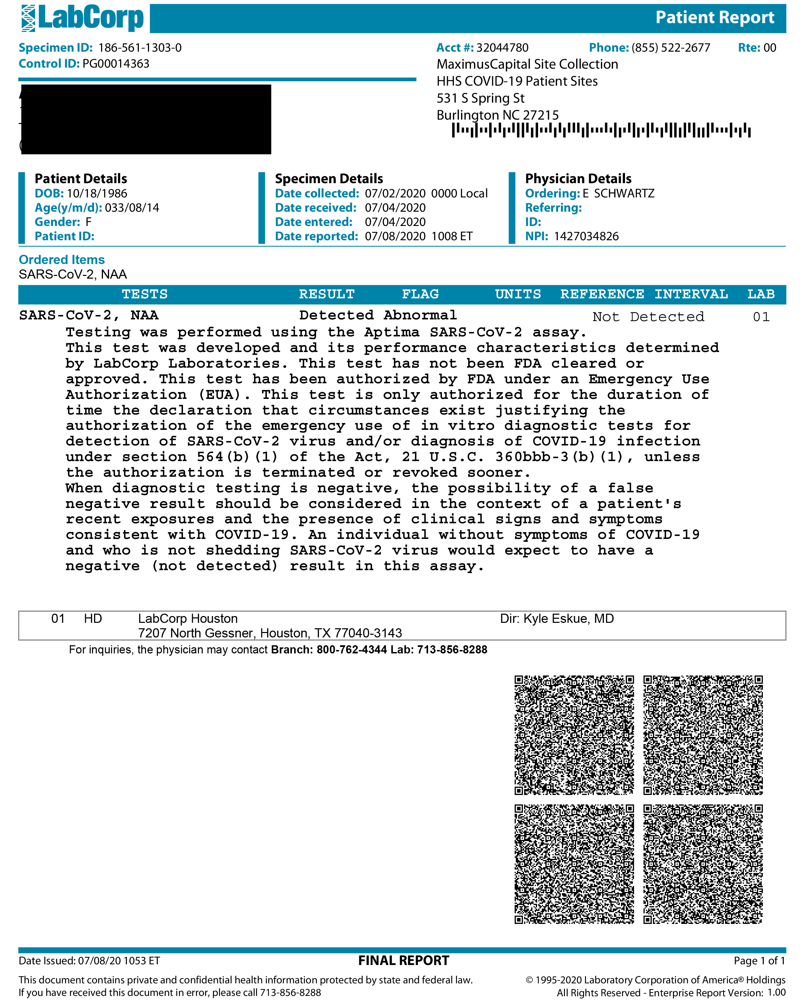

# OpenCerta Certificates  <br />A Vision for Digital Health Certificates


# Abstract

This specification describes a mechanism for the issuance of tamper-evident, verifiable digital health certificates, their ecosystem, and establishing resources for its validation.


# Contributors

Name | Company
-----|--------
Alfonso Olvera | MagnaCerta, Inc.
Ramon Torres | MagnaCerta, Inc.
Diana Solares | MagnaCerta, Inc.
Michael J. Kirwan | DSheet, LLC


# Introduction

The COVID-19 pandemic has forced the world's economies to operate at a limited capacity. Social distancing measures have resulted in the closing of borders, schools, offices, entertainment and sporting venues, while other establishments that remain open do so with limited seating.

As additional avenues for widespread testing and vaccines become a reality, the world will begin to re-open gradually, provided it can be done in a safe and controlled manner. Inevitably, there is a need for a technology to assist, in the form of a credential certifying someone's safe health status. These credentials should be easy to issue, carry, and authenticate, but virtually impossible to counterfeit, while also respecting the privacy of individuals. 

Security, like time, is of the essence; therefore it is imperative to build on a foundation of open and proven standards so that a solution for Digital Health Certificates becomes a reality that can be easily implemented and widely adopted.

This solution has to be:

* Reliable – non-forgeable and revocable
* Respecting of privacy
* Inclusive – does not discriminate against populations lacking wide access to smartphones or connectivity.
* Credible from day one: utilizing existing, simple, proven  technologies.
* Open – use of known, open framework and set of standards 	

The OpenCerta Digital Health Certificate proposed in this specification is a document that provides the main functions of a traditional paper health certificate:

* Identity: typically, but not necessarily, a headshot/photograph of the certificate holder, his or her name, and/or any required identification details.
* Certificate Type: the type of certification, which also dictates claim schema. (e.g. immunization certificate, diagnostic test certificate, etc).
* Claims: statement(s) about the status of the subject.
* Authenticity: indicated by a digital signature from the issuing authority.

The main advantage of a digital certificate is that the above information can be made tamper-evident and revocable. In particular, the signature of the issuing authority can be readily verified as being both valid at time of issuance and at the present time. In other words, certificates issued by bad-actors can be invalidated, allowing for real-time verification of a Digital Health Certificate through a service provider, which could reflect important changes in the value of attestation.

A Digital Health Certificate can, in principle, be stored in any medium capable of storing digital information. In addition to this, certificates can be printed onto any media capable of carrying a 2D Barcode, a QR Code[^1]. It is worth mentioning that even in printed form, these barcodes and the Health Certificates they embody, remain as secure and tamper-evident as in digital form, and retain all elements, including its digital signature.

In an effort to employ existing standards and technologies, OpenCerta Certificates adhere to the Verifiable Credentials (VC)[^2] specification as published by the World Wide Web consortium.

Additionally, OpenCerta Certificates operate under a trust framework based on X.509[^3], an open and cryptographically secure claim-attestation standard. X.509 is at the core of the secure exchange of digital information and transactions on the Web, and has been in widespread use for decades.

The OpenCerta Certificate also guarantees privacy as it supports carrying the minimum required personal information identifying the bearer of the certificate such as a headshot, held within the certificate itself without the need to store the data externally. 

The Digital Inclusion Foundation, a non-profit entity, will be responsible for publishing the specification, providing open source reference implementations of the standard and will be the Trust Anchor as defined by the X.509 standard[^4].  The foundation will be an agnostic body which will not interpret any Claims within OpenCerta Certificates.


# Scope

This document proposes an open and interoperable specification for a digital health certificate whose focus is keenly on the privacy, security, ethics and inclusiveness of individuals.

In defining a holistic solution for a digital health certificate, this proposed specification is an implementation of the World Wide Web Consortium (W3C)'s Verifiable Credentials recommendation, using JSON-LD[^5] for open-world schema modeling, while incorporating the use of X.509 certificates as its preferred trust framework.

The proposed specification will provide the hierarchical management of health organizations and practitioners responsible for signing OpenCerta Certificates. It will include compliance with HL7 FHIR[^6] standards with the objective of ensuring interoperability between health systems, while ensuring that claims of a medical procedure on the certificate are scientifically authentic.


# Ecosystem Overview

**OpenCerta Certificate**

An OpenCerta Certificate consists of a Verifiable Credential as established by the W3C Consortium, signed by a Health Practitioner through his or her authority established by the trust framework. 

**Digital Pen**

A certificate that grants authority to a Health Practitioner to issue OpenCerta Certificates. In X.509 terms, the Digital Pen Certificate is an End Entity (EE) Certificate. A Digital Pen cannot issue child X.509 certificates. Also referred to as Digital Pen Certificate within this document.

**Holder**

A holder of an OpenCerta Certificate carries the certificate in order to present it to a verifier. The holder of an OpenCerta Certificate may or may not be its subject. For example, a parent or guardian may want to carry his or her children's OpenCerta Certificate on their behalf.

**Health Organization**

A public or private organization involved in the health ecosystem who will hold an X.509 Organization Certificate, enabling their issuance and management of subsequent X.509 certificates to additional underlying Health Organizations and Health Practitioners. 

**Health Practitioner**

A Health Practitioner is a health professional who engages in medical procedures. Health Practitioners will issue OpenCerta Certificates and sign them with their Digital Pen.

**Organization Certificate**

An Organization Certificate is an intermediate CA certificate that grants authority to a Health Organization to issue additional certificates to underlying organizations and/or Digital Pens.

**Subject**

A subject in the context of an OpenCerta Certificate is an individual who is claimed to have had a medical procedure performed, which could include an immunization or a test. Could also be referred to as Patient.

**Verifier**

A verifier of an OpenCerta Certificate validates that the certificate was issued by a valid Practitioner, as well as that the claims stated within the certificate are current, in order to grant access to the resources they control and limit access to.

**Verifiable Data Registry**

An entity or system that is responsible for the creation and verification of identifiers, keys, and other relevant data, such as verifiable credential schemas, certificate revocation lists, issuer X.509 certificates, all of which are required for an OpenCerta Certificate ecosystem to operate.

# Core Components

The proposed specification involves the use of multiple open and widely recognized standards. The following is a description of the core components or technologies that are proposed in implementations of this specification. 


## X.509 Standard

The ability to delegate responsibility related to the issuance of certificates is imperative. A hierarchical & transitive trust framework is suggested for implementation feasibility. 

The technology and trust framework used by OpenCerta Certificates relies on the X.509 standard. The X.509 standard includes a model for establishing a hierarchy of certificate authorities, as well as native revocation protocols. In the context of OpenCerta Certificates, Health Organizations are able to delegate responsibility to other Organizations and ultimately to Health Practitioners. 

The Digital Inclusion Foundation, a non-profit foundation will hold the Trust Anchor[^7] as defined by the  X.509 standard, and will act as the highest entity in the chain of authority. It will issue X.509 certificates to the next immediate level, which could include Health Organizations as well as third-party service providers who may implement the OpenCerta specification to provide a commercial service offering related to OpenCerta Certificates, including the registration and management of Organization Certificates and Digital Pens. In addition to this, the Trust Anchor will define and hold the agreed upon schemas for different medical procedures, as well as a registry of the X.509 certificates that it issued, along with processes to manage the certificate revocation lists.


## Verifiable Credentials Standard

The Verifiable Credentials standard allows for machine-readable and extensible documents, while providing a cryptographic layer for security, selective disclosure of claims, and verification of the authenticity of such documents.

The use of Verifiable Credentials, as published by the World Wide Web consortium, provides a standard to express credentials on the Web in a way that is cryptographically secure, privacy respecting, and machine verifiable. 

The significance of their use within an OpenCerta Certificate is that such certificates are credentials in nature as defined by the standard, and therefore it is beneficial to use a standard that fits the relevant use-case, supporting uniformity across systems. In addition to this, the Verifiable Credentials standard provides mechanisms for maximizing the privacy of the subject by enabling the selective disclosure of claims to verifiers while maintaining cryptographic tamper-evident features. 




## JSON-LD

JavaScript Object Notation for Linked Data, [https://www.w3.org/TR/json-ld11/](https://www.w3.org/TR/json-ld11/), is used to describe a recommended best practice for exposing, sharing, and connecting information on the Web using standards, such as URLs, to identify things and their properties. An extension of JSON, linked data allows for a graph of knowledge and formal standardization of schemas for the verifiable credentials.

Now all entities in a document, such as an OpenCerta Certificate, can be unambiguously referenced via an automatic URI and verified via cryptographic proofs. Proofs that can be shared without the loss of trust, authentication by a particular identifier, delegation of authority for actions in a remote environment, contract agreements by third parties and proofs that can be identified as tamper-evident.

The JSON-LD specification adds authentication and integrity protection to linked data documents through the use of mathematical proofs without sacrificing Linked Data features such as extensibility and composability.


## HL7 FHIR Standard

Complying with HL7 schemas for medical procedures allow OpenCerta Certificates to support interoperability between health systems. For example, for immunizations and vaccinations, the HL7 FHIR resource, [https://www.hl7.org/fhir/immunization.html](https://www.hl7.org/fhir/immunization.html), “is intended to cover the recording of current and historical administration of vaccines to patients across all healthcare disciplines in all care settings and all regions”. 


## QR Codes

Encoding the OpenCerta Certificates into QR codes allows for the storage and transportation of the certificates in non-digital media. QR codes can be printed on paper and can be efficiently decoded by use of an optical scanner. Their use within an OpenCerta Certificate enables both on-line and off-line verification. See QR code examples below. 


# Use-Case


## Immunization Certificate

Providing a tamper-evident certificate of immunization is a key use-case for an OpenCerta Certificate. These certificates can result in the tamper-evident equivalent of the International Certificate of Vaccination or Prophylaxis as approved by the World Health Organization, otherwise commonly referred to as Yellow Card Certificate[^8]. This certificate contains the identity of the subject, claims as to the immunization of the subject of the certificate, as well as the identification and signature of the Practitioner that issued the certificate.

An OpenCerta Certificate could provide the same information while adding a cryptographic mechanism to display any evidence of tampering or counterfeiting of the certificate. In addition to this, the OpenCerta Certificate provides a mechanism to revoke the certificate in the event that the Practitioner or organization who issued it is found to be a bad actor, always keeping into consideration privacy for the individual holding the certificate.


## Diagnostic Testing

Another key use case of OpenCerta Certificates is diagnostic testing. In the context of COVID-19, diagnostic tests are used to find the presence of the virus within a patient's sample. 

An OpenCerta Certificate could be used to attest that an individual does not have the presence of the virus and therefore is deemed safe to gain entry into the verifier's controlled area or resource.


# Key Process Overview


## Onboarding of Health Authorities 

Health Organizations, such as a governments, hospital systems, laboratories, and related institutions will hold an X.509 certificate and will in turn issue additional X.509 certificates. This is foreseen to be done via a front-end application or through an API integration by a service provider. Service providers will provide a data registry and a set of tools to manage certificates of authority. Using an administrative tool similar to a PKI management tool, the Health Organization will be able to generate and sign a new X.509 certificate for a sub- organization or a Digital Pen. 

As part of the onboarding process, it is recommended that a KYC (Know Your Customer) third-party service is used for identity validation of the X.509 certificate's subject such as the legal representative of a Health Organization, or the Health Practitioner who is being issued a Digital Pen.


## Onboarding of Health Practitioners

Health Practitioners will be onboarded in an identical way as the Health Organization. Health Practitioners will use Digital Pens, who will have the authority to issue OpenCerta Certificates. Health Organizations are accountable for the Health Practitioners that they enrolled under their authority. 


## Issuing an OpenCerta Certificate

A Health Practitioner will use a front-end or back-end application provided by the Health Organization's Service Provider to issue an OpenCerta Certificate. The issuance of an OpenCerta Certificate should ideally avoid the need for a Health Practitioner to be online at the time of issuance, for example, when the Health Practitioner is using a mobile app while working in remote areas with no service coverage.

Once issued, an OpenCerta Certificate will be either printed and given to the patient at the time of issuance using a graphical codification using 2D Barcodes, or it will be electronically transmitted to them in a binary machine-readable format that can be imported into a compatible wallet application.


## Holding and Transporting an OpenCerta Certificate

OpenCerta Certificates can be held in paper media through the use of 2D Barcodes, or they can be held digitally in a machine-readable binary format.

Wallet applications may be developed with the purpose of providing a storage and management repository for OpenCerta Certificates.

OpenCerta Certificates may be stored anywhere the user desires, either physically or digitally. Examples of these are in paper media, or in backup services such as iCloud, Dropbox, as well as local digital storage within their devices. 


## Verifying an OpenCerta Certificate

The holder of an OpenCerta Certificate has the option of showing the set of 2D barcodes using the wallet application in a mobile device or the printed version to a verifier who in turn uses a front-end application on a device to optically scan the barcodes. The verifier application will validate that the contents of the OpenCerta Certificate have not been tampered with using the public key in the X.509 certificate that produced the digital signature or proof within the OpenCerta Certificate. The application may then define a visual result based on additional business logic to evaluate the claims in the certificate. 

The Digital Pen and the Verifier are not required to have any relationship with each other nor an established connection to each other. 


## Digital Pen and OpenCerta Certificate Revocation

The X.509 standard provides a mechanism for the revocation of certificates. A certificate is irreversibly revoked if, for example, it is discovered that a Health Practitioner, a.k.a. Digital Pen, has improperly issued a certificate, or if a private-key is thought to have been compromised. Certificates may also be revoked for failure of the identified entity to adhere to policy requirements or violation of any other policy specified by the Health Organization or Government. The most common reason for revocation is the user no longer being in sole possession of the private key.

It is the responsibility of the Health Organization that issued underlying Organization Certificates or Digital Pens to ensure that the revocation of such certificates under its jurisprudence happens in a timely manner in the event of a bad actor or a security compromise. 

An OpenCerta Certificate may be added to a certificate revocation list;  the list includes a revocation date which could be in the past.  All OpenCerta Certificates issued after the revocation date are invalid.

The Verifier must check the validity of any OpenCerta Certificate's signing Digital Pen by checking the Digital Pen Certificate's serial number against a published certificate revocation list. 

*   When a Digital Pen is revoked, its serial number is added to a revocation list, as well as the effective date of revocation.
*   OpenCerta Certificates issued by such Digital Pens on or after the revocation date are invalid.
*   Revocation lists should follow the standard: RFC 5280[^9].
*   Service providers may also expose revoked certificates using 'Online Certificate Status Protocol': RFC 6960[^10].


## Digital Pen Expiration

A Digital Pen is required to expire in order to ensure that it is using the latest security standards and that the private key is, in-fact, controlled by the intended Health Practitioner. Issuing short-lived certificates will help mitigate any key compromises of the Digital Pen.

The OpenCerta Certificate’s validity is not affected by the expiration of the Digital Pen that signed it.

Reissuing a Digital Pen Certificate should require reconfirmation of Health Practitioner identity.


## OpenCerta Certificate Expiration

OpenCerta Certificates can have a limited period of validity depending on the medical procedure being claimed. This validity must be defined as part of the certificate's schema, to be enforced by the Verifier. An OpenCerta Certificate may or may not have a limited period of validity. 


# Example Schemas and Diagrams


## OpenCerta Certificate Example Schema

The following is an example of an OpenCerta Certificate related to an immunization.


```
    {
      "@context": "https://www.w3.org/2018/credentials/v1",
      "type": [ "VerifiableCredential", "Immunization" ],
      "issuanceDate": "2020-07-10T19:23:24Z",
      "credentialSubject": {
        "type": "fhir:Immunization",
        "@context": "https://opencerta.org/certificate/v1",
        "role": "fhir:treeRoot",
        "Immunization.status": { "value": "completed" },
        "Immunization.notGiven": { "boolean": false },
        "Immunization.vaccineCode": {
          "CodeableConcept.coding": [{ "index": 0, "Coding.display": { "value": "AZD1222" } }],
          "CodeableConcept.text": { "value": "SARS-CoV-2" }
        },
        "Immunization.patient": {
          "Patient.name": [{
            "index": 0,
            "HumanName.family": { "value": "Donald" },
            "HumanName.given": [{ "index": 0, "value": "Daisy" }]
          }],
          "Patient.gender": { "value": "female" }
        },
        "Immunization.date": { "date": "2020-07-10" },
        "Immunization.primarySource": { "boolean": true },
        "Immunization.manufacturer": {
          "Organization.name": { "value": "AstraZeneca; The University of Oxford; IQVIA" }
        },
        "Immunization.lotNumber": { "value": "AAJN11K" },
        "Immunization.expirationDate": { "date": "2021-07-09" },
        "Immunization.location": {
          "Location.address": {
            "Address.city": { "value": "Houston" },
            "Address.state": { "value": "TX" },
            "Address.country": { "value": "US" }
          }
        },
        "Immunization.practitioner": [{
          "index": 0,
          "Practitioner.name": [{
            "index": 0,
            "HumanName.family": { "value": "Careful" },
            "HumanName.given": [{ "index": 0, "value": "Adam" }],
            "HumanName.prefix": [{ "index": 0, "value": "Dr" }]
          }]
        }]
      },
      "proof": { ... }
    }
```

## OpenCerta Certificate Presentation Examples







## Notes

[^1]:
     [https://en.wikipedia.org/wiki/QR_code](https://en.wikipedia.org/wiki/QR_code)

[^2]:
     [https://en.wikipedia.org/wiki/Verifiable_credentials](https://en.wikipedia.org/wiki/Verifiable_credentials)

[^3]:
     [https://en.wikipedia.org/wiki/X.509](https://en.wikipedia.org/wiki/X.509)

[^4]:
     [https://en.wikipedia.org/wiki/Trust_anchor](https://en.wikipedia.org/wiki/Trust_anchor) 

[^5]:
     [https://www.w3.org/2018/jsonld-cg-reports/json-ld/](https://www.w3.org/2018/jsonld-cg-reports/json-ld/)

[^6]:
     [https://en.wikipedia.org/wiki/Fast_Healthcare_Interoperability_Resources](https://en.wikipedia.org/wiki/Fast_Healthcare_Interoperability_Resources)

[^7]:
     [https://en.wikipedia.org/wiki/Trust_anchor](https://en.wikipedia.org/wiki/Trust_anchor)

[^8]:
     [https://en.wikipedia.org/wiki/Carte_Jaune](https://en.wikipedia.org/wiki/Carte_Jaune)

[^9]:
     [https://www.rfc-editor.org/info/rfc5280](https://www.rfc-editor.org/info/rfc5280)

[^10]:
     [https://www.rfc-editor.org/info/rfc6960](https://www.rfc-editor.org/info/rfc6960)
